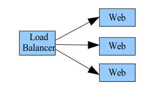

##  PROBLEM I (sockets)


You have to realize with Java sockets a load balancer (a class `LoadBalancer` ) which receives HTTP requests and distributes them randomly to a set of Web servers. The beginning of the `LoadBalancer` class is the following:

```java
public class LoadBalancer {
	static String hosts[] = {"host1", "host2"};
	static int ports[] = {8081,8082};
	static int nbHosts = 2;
	static Random rand = new Random();
...
}
```



Each time a HTTP request is received, `LoadBalancer` transfers the request to one of the web servers (the addresses of these servers are given by the `hosts` and `ports`) and `LoadBalancer` transfers the result of the request to the sender. The choice of the web server is randomized `(rand.nextInt(nbHosts)` returns an integer between 0 and nbHosts-1). To be efficient, `LoadBalancer` is obviously multi-threaded.

For the programming of the inputs/outputs, we will use :

- InputStream
  - `public int read(byte[] b); // blocking, returns the number of bytes read`
- OutputStream
  - `public void write(byte[] b, int off, int len); // write the len bytes to the off position`
  
And it is assumed that requests and responses are read or written in a single method call with a buffer of 1024 bytes.