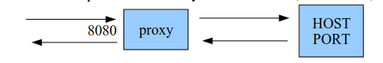

## Assignment

### PROBLEM I (Sockets)

We want to implement with Java sockets a TCP streaming proxy. More precisely, you have to realize a program which:

- accepts TCP connections on port 8080 (called C1)
- for each accepted connection, creates a connection (called C2) to a given site (by 2 constants HOST, PORT)
  - any data received on C1 is sent to C2
  - any data received on C2 is sent to C1
- No assumptions can be made about the volume or speed of data transmission over these TCP connections. Data can be sent in one direction, in the other, or in both directions.



### How to run

From the command line, run:

```bash
chmod +x run.sh
./run.sh google.com 80
```
## Folder Structure

The workspace contains two folders by default, where:

- `src`: the folder to maintain sources
- `lib`: the folder to maintain dependencies

Meanwhile, the compiled output files will be generated in the `bin` folder by default.

> If you want to customize the folder structure, open `.vscode/settings.json` and update the related settings there.

## Dependency Management

The `JAVA PROJECTS` view allows you to manage your dependencies. More details can be found [here](https://github.com/microsoft/vscode-java-dependency#manage-dependencies).

